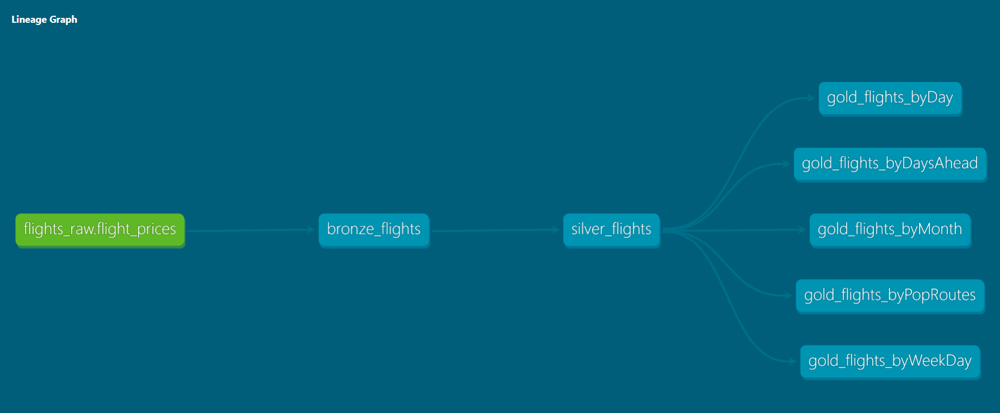

# Data Pipeline + AI Assistant for Flight Tickets

## Data Pipeline

This part of the project automates the process of fetching, parsing, and loading flight price data into a database. It utilizes web scraping, HTML parsing, data validation, and database loading.

### Purpose

* Fetch flight price data for a specified route.
* Parse the HTML content of the scraped flight data.
* Extract relevant flight information, including departure/arrival details, flight numbers, and ticket prices.
* Validate the extracted data with Pandera.
* Load the validated data into a Postgres SQL database.
* Trigger dbt (data build tool) models to transform and analyze the loaded data.

### Requirements

* Python 3.12.1
* `beautifulsoup4` >=4.13.3
* `chromadb` >=0.6.3
* `currencyconverter` >=0.18.3
* `dbt-postgres` >=1.9.0
* `dotenv` >=0.9.9
* `groq` >=0.18.0
* `langchain`
* `langgraph` >=0.3.5
* `numpy` ==1.26.4
* `pandas` >=2.2.3
* `pandera` >=0.23.0
* `psycopg2-binary` >=2.9.10
* `selenium` >=4.29.0
* `sentence-transformers` >=3.4.1
* `sqlalchemy` >=2.0.38
* `streamlit` >=1.42.2
* `torch` >=2.6.0
* `tqdm` >=4.67.1

### Functionality

The script defines a primary function, `update_db(d, origin_cd, destin_cd)`, which performs the following steps:

1.  **Date Retrieval:**
    * Calculates the search date by adding `d` days to the current date using the `get_date` function from `updatedb.webscraping`.
    * Displays the search date in the Streamlit application.

2.  **Web Scraping (Commented Out):**
    * The `get_flights` function (from `updatedb.webscraping`) for web scraping is commented out. This would typically fetch the HTML content of the flight search results.
    * This current version instead opens a static html file called `data/flights.html` for parsing.

3.  **HTML Parsing:**
    * Initializes a `Parser` object (from `updatedb.parser`).
    * Opens the `data/flights.html` file using the parser.
    * Finds all flight departure elements using BeautifulSoup.

4.  **Data Extraction:**
    * Iterates through the departure elements and extracts flight details:
        * Departure city, date, and time.
        * Arrival city and time.
        * Flight number, number of stops, and flight duration.
        * Ticket Prices.
    * Stores the extracted data in lists.

5.  **Data Processing:**
    * Handles edge cases, such as the first entry having an incorrect date, and fills in missing price data.
    * Creates a Pandas DataFrame from the extracted lists.
    * Fills missing values using forward fill and backward fill.
    * Saves the DataFrame to a CSV file (`data/flights.csv`).

6.  **Database Loading:**
    * Calls the `load_to_sql` function (from `updatedb.load_sql`) to validate the data using Pandera and load it into the SQL database.

7.  **dbt Execution:**
    * Executes the `run_dbt` function (from `updatedb.load_sql`) to trigger dbt models for data transformation and analysis.

## Web Application: AI Assistant

This Streamlit application provides an interface for interacting with flight price data stored in a PostgreSQL database. It offers two main functionalities: updating the database with new flight prices and querying the database using natural language through AI assistants.

### App

The application aims to:

* **Update Flight Price Data:** Allow users to schedule updates to the database with flight price information for specified date ranges and city codes.
* **SQL Query Database via Natural Language:** Enable users to ask questions about the flight data in natural language, which are then translated into SQL queries or used to generate analytical insights.
* **Ask Analyst AI Assistant:** Enable users to ask questions about the flights data to an AI Analyst that provides insights.

### Functionality

The application is structured with a sidebar for database updates and a main page for querying the data.

#### Sidebar: Update DB

* Allows users to select multiple days ahead for which to update flight prices.
* Provides input fields for origin and destination city codes.
* Includes a button to trigger the `update_db` function, which fetches, parses, and loads flight price data into the database.
* Displays a success message upon completion of the database update.

#### Main Page: Querying the Database

* Provides two AI assistant options: "SQL Assistant" and "Flight Analyst."
* **SQL Assistant:**
    * Allows users to enter natural language questions.
    * Uses a LangGraph workflow to:
        * Translate the question into an SQL query.
        * Execute the SQL query against the database.
        * Generate a natural language answer based on the query results.
    * Displays the generated answer and the executed SQL query.
* **Flight Analyst:**
    * Allows users to enter natural language questions.
    * Uses the `groq_response` function to generate an analytical response based on the question.
    * Displays the generated response.
* Displays the current BRL to USD conversion rate.

### Usage

1.  **Updating the Database:**
    * In the sidebar, select the desired number of days ahead.
    * Enter the origin and destination city codes.
    * Click the "Update DB" button.

2.  **Querying the Database:**
    * On the main page, select either "SQL Assistant" or "Flight Analyst."
    * Enter your question in the text input field.
    * Click the "Run" button.
    * View the generated answer or analysis.

### Notes

* Ensure that the necessary database connection details and API keys (GROQ) for the AI assistants are configured correctly.
* The bug fix for the torch class path is included in the code.
* The streamlit page is configured to be wide, and the sidebar is collapsed by default.

## Demonstration

<table>
  <tr>
    <td width="50%"></td>
    <td width="50%"></td>
  </tr>
</table>

## About

This project was developed by Gustavo R Santos. 
[Linkedin](https://www.linkedin.com/in/gurezende/) 
[Website](https://gustavorsantos.me)

## License
Project licensed under MIT License.